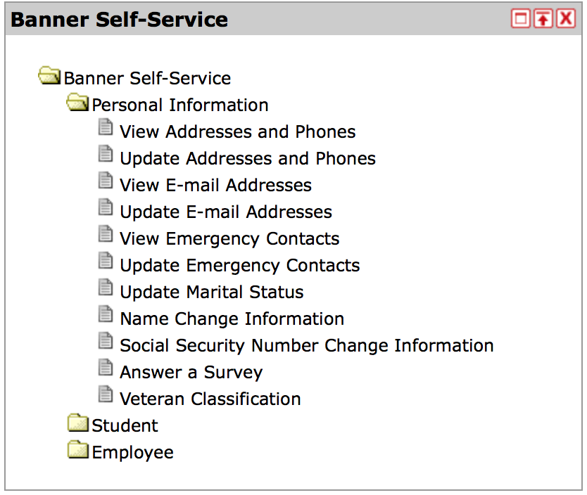

#Task Analysis
The goal of this project is to redesign the webpage where the user is able to update personal information (such as emergency
contacts, name changes, address changes, etc.) Currently the important information and where to input new information is spread around
in various pages. The goal is to bring them all together into a single page in a manner that is simple and fluid.

**Below are the current steps required to reach (one of the pages) that allows you to change/add personal information.**
 
1. **STEP:** 

    User logs in via my.iit.edu website and is greeted with the welcome page:
    
    *Welcome page
2. **STEP:**
    
    User must then find tucked in the corner a menu labeled "Banner Self-Service.
    
    The user is presented with an overwhelming amount of options that they have to swift through
    in order to find something as simple as viewing their emergency contacts.
    
    *Banner Self Service 
    
3. **STEP:**

    Once the user decides what page they wish to visit they are presented with this.
    For this example we selected the page to update/add phone numbers.
    We believe that the layout is both uninviting and too small (the whole point of this page is to add phone numbers
    and the place where you can do that takes about 10% of the page.)
    
   
   
4. **STEP:**

    This next capture is of the same page. Here we demonstrate the minute size of the most important thing on this page.
    There is also a large and unatractive wall of text explaining how to add a simple phone number.
    We will be looking to simplify this while still being informational to the user.
    
    
  
**This is an example for the page where you can update/add phone numbers. All the other pages for things like name updates or 
emergency contact updates follows this similar pattern of being hidden away behind too many clicks.**

**GOALS:**

1. **Plan an execute a simple and visualing appealing process to update information.**
     
2. **Redesigned my.iit.edu log in page:**
    *[MyIIT](https://my.iit.edu/cp/home/displaylogin)
    Create a log in page where the main focus of the site is to log in, opposite to what is currently the case.
    
3. **Redesigned MyIIT welcome page:**
    Attempt to organize the information better. While we agree that a lot of the information on the site
    is useful and beneficial (thus required to be on the page,) we agree that it could be presented in a more appealing manner.
    If we cannot "uncrowd" the information then we must find a way to make it pleasant to look at.
    
    
4. **Redisgn the "Personal Information" part of the website:**
    As described in the first section of this markdown. This is the portion of the website that our group
    will be focusing on.
