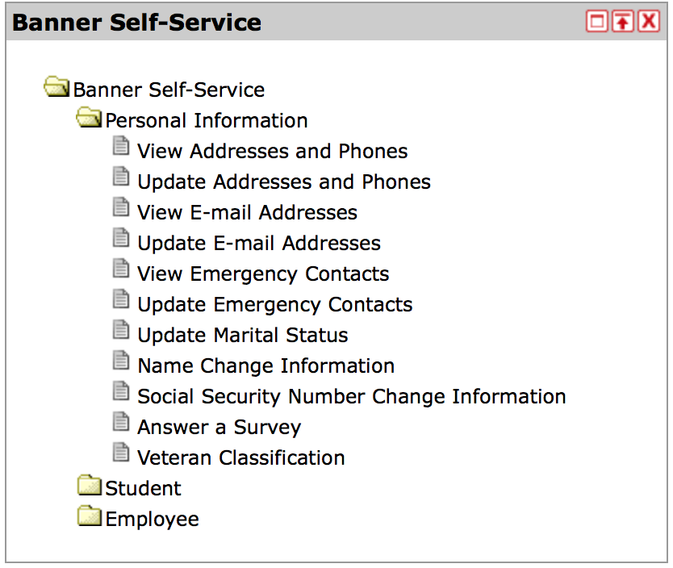

#Task Analysis
*The goal of this project is to redesign the webpage where the user is able to update personal information (such as emergency
contacts, name changes, address changes, etc.) Currently the important information and where to input new information is spread around
in various pages. The goal is to bring them all together into a single page in a manner that is simple and fluid.

**Below are the current steps required to reach (one of the pages) that allows you to change/add personal information.**
 
1. **STEP ONE:** 

    User logs in via my.iit.edu website and is greeted with the welcome page:
    
    *Welcome page
    *Banner Self Service here you can view OR update your personal information  
   
    
    *This is the same for all other items
4. **Decide as a team on a better design**
    * 
5. **Redesigned MyIIT login page**
    *[MyIIT](https://my.iit.edu/cp/home/displaylogin)
    * 
6. **Redesigned MyIIT welcome page**
    * 
7. **Redisgn the "Personal Information" part of the website**
    * 
