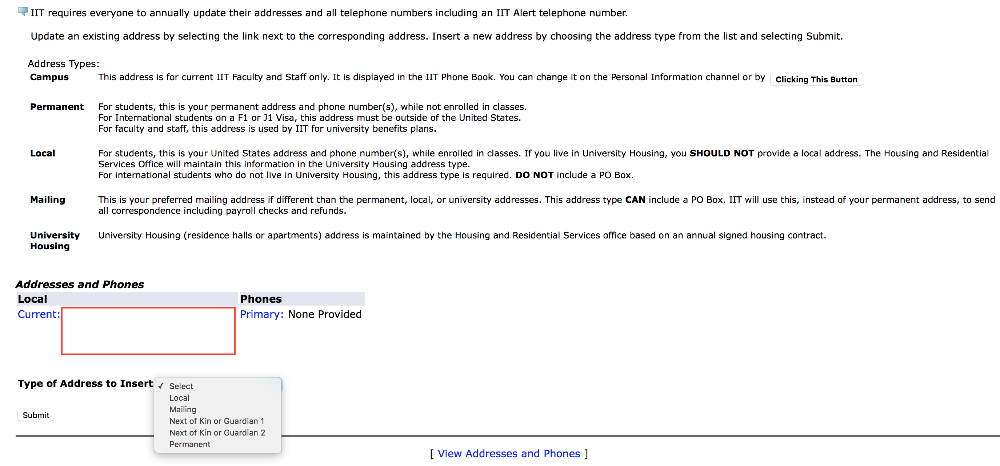

#Deliverable no. 2
*Here we will describe the list of steps that we need to take to redisgn the "Personal Information" part of the website.
1. ****Identify the current route to get to the "Personal Information" part of the website
    * the current 
    *
2. **think about a better way to present the information**
    * brainstorm
    * ask other people
3. **The current site goes like this**
    *Log in 
    *Welcome page
    *Banner Self Service here you can view OR update your personal information  
   
    
    *This is the same for all other items
4. **Decide as a team on a better design**
    * 
5. **Redesigned MyIIT login page**
    *[MyIIT](https://my.iit.edu/cp/home/displaylogin)
    * 
6. **Redesigned MyIIT welcome page**
    * 
7. **Redisgn the "Personal Information" part of the website**
    * 
